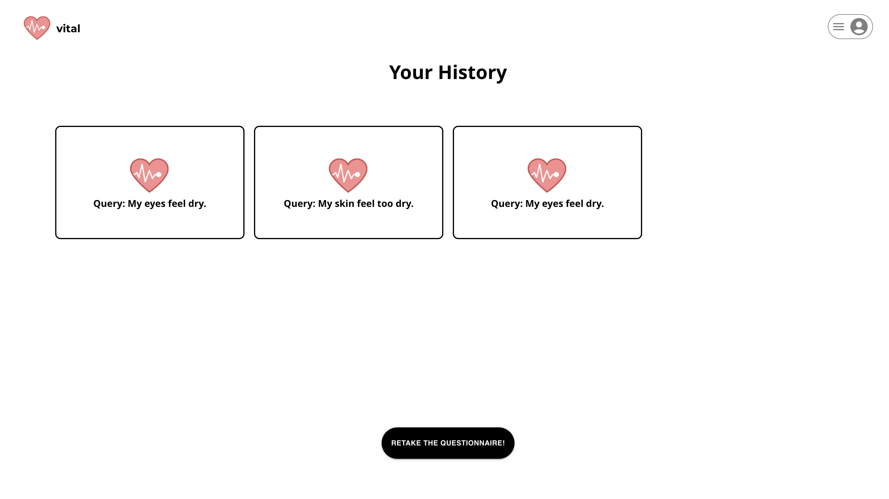

# Project Overview

Vital uses users' personal physical information including their age, gender, allergies, and a text input where they write how they specifically want to improve their health. After entering those information, the users' information will be used to generate a list of the top recommended dietary supplement to take. This will help users save time, money, and confusion from spending time searching for which supplements to buy. The user will be able to enter new information to get supplement recommendations for different reasons and conditions.

## Figma design

## Vital System Architechture

